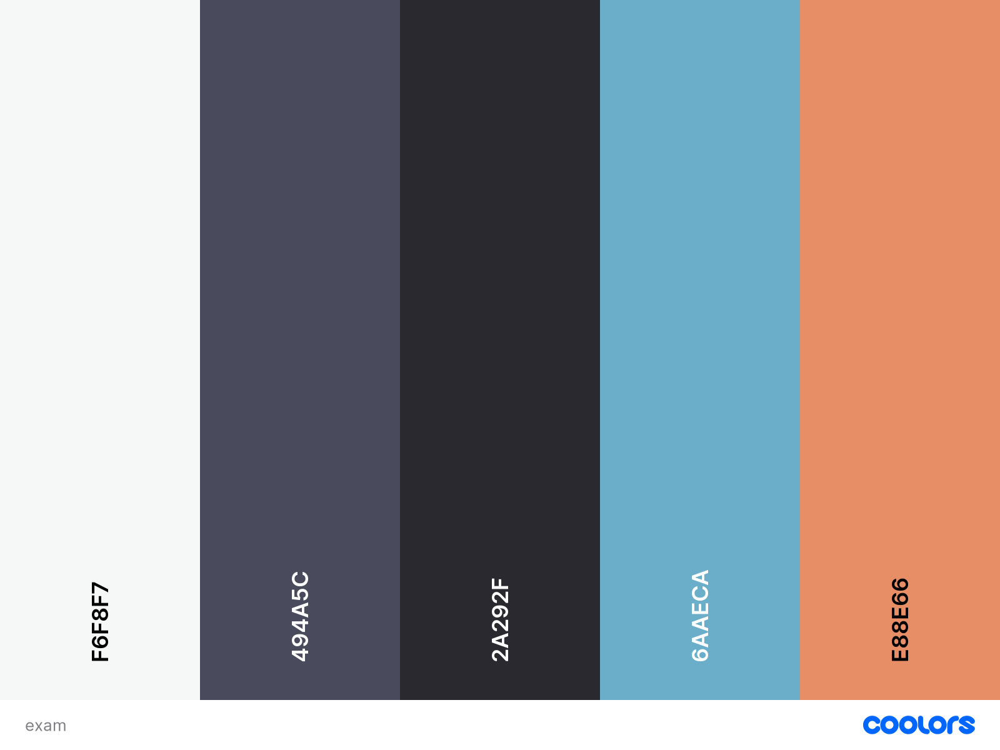

# 1620_Exam_2022
1620 Exam Instructions and starter code


## Project Assets

### Colors



### Icons

[font awesome](https://fontawesome.com/)

#### Example adding an icon

```HTML
  <span class="fa-solid fa-ghost"></span>
```

### Type

Sans-serif Inter `font-family: 'Inter', sans-serif;`
weights: ExtraLight 200 and Medium 500

#### Example use

```CSS
  font-family: 'Inter', sans-serif;
  font-weight: 200;
```
